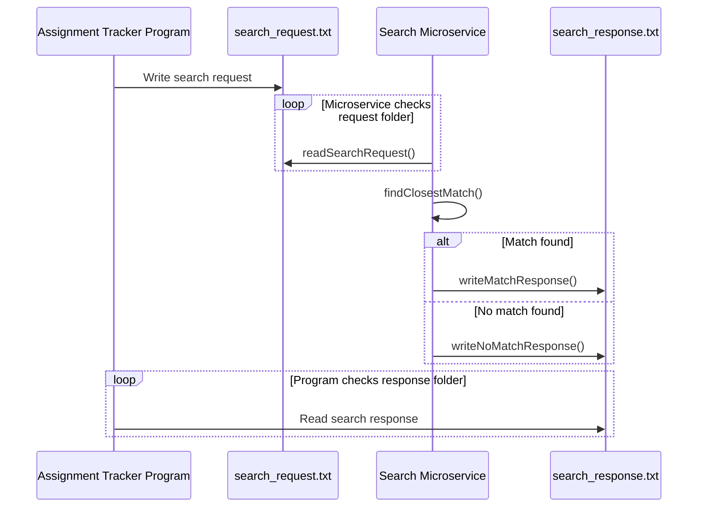

# Search Microservice

## Description
The Search Microservice allows another program to send a search query and receive the closest matching result. It can also search within a specific category and limit the number of results returned.

## Communication Pipe
This microservice uses text files as the communication pipe.

The requesting program writes a request text file into a shared `requests` folder. The microservice checks that folder, reads the request, processes the search, and writes a response text file into a shared `responses` folder.

## How to Request Data
Create a text file named `search_request.txt` inside the `requests` folder.

Required parameter:
- `query`: the search text

Optional parameters:
- `category`: limits the search to a specific category
- `limit`: limits the number of matches returned

Example request file:

```text
query=calculus homework
category=assignments
limit=1
```

Example request code:

```python
from pathlib import Path

request_file = Path("requests/search_request.txt")
request_file.write_text(
    "query=calculus homework\n"
    "category=assignments\n"
    "limit=1\n",
    encoding="utf-8",
)
```

## How to Receive Data
The microservice creates a response file named `search_response.txt` inside the `responses` folder.

Example response file:

```text
match_found=true
closest_match=Calculus Homework 5
confidence_score=0.92
```

Example receive code:

```python
from pathlib import Path

response_file = Path("responses/search_response.txt")
response = response_file.read_text(encoding="utf-8")
print(response)
```

## How to Run
Open two terminals from this folder.

Terminal 1:

```bash
python search_microservice.py
```

Terminal 2:

```bash
python test_program.py
```

## UML Sequence Diagram


